# Jaringan Komputer

## Definisi
Jaringan komputer adalah sebuah **sistem** yang terdiri dari **dua atau lebih komputer** yang **saling terhubung satu sama lain melalui media transmisi** dan **media komunikasi** sehingga dapat **saling berbagi data aplikasi maupun berbagi perangkat keras komputer**.

Jaringan komputer terdiri atas:
1. Personal area network (PAN)
	- Kontrol dilakukan dengan authoritas pribadi.
	- Data yang ditransmisikan bersifat khas dan personal karena digunakan hanya untuk kepentingan pribadi.

2. Local area network (LAN)
	- Mempunyai kecepatan transfer data yang lebih tinggi.
	- Mencakup wilayah geografis yang lebih sempit.
	- Tidak perlu menyewa jalur telekomunikasi dari operator telekomunikasi.
	- Salah satu komputer di antara jaringan komputer digunakan sebagai server.

3. Metropolitan area network (MAN)
4. Wide area network (WAN)

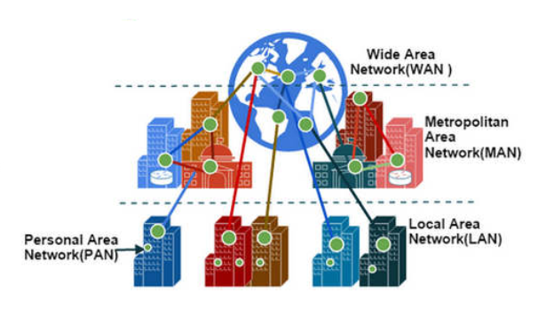 

# Internet

## Definisi
Internet adalah sebuah jaringan yang **menghubungkan komputer satu sama lain** yang menggunakan **standar sistem global *Transmission Control Protocol* atau *Internet Protocol Suite* (TCP/IP)** sebagai **protokol pertukaran sehingga kita bisa saling berkomunikasi, berinteraksi, dan saling bertukar informasi meski dalam jarak yang jauh**.

## Intranet
Intranet adalah suatu **jaringan privat** yang **terhubung dengan menggunakan protokol-protokol internet TCP/IP** untuk **berkomunikasi dan mengirim informasi rahasia dalam lingkup terbatas**, misalnya pada sekolah, universitas, dan perusahaan.

Suatu organisasi dapat membangun intranet jika memiliki beberapa komponen protokol internet yang sering
digunakan, baik itu hardware maupun software. Diantaranya:
- Komputer (*client*)
- Server
- Hub
- Modem
- Protokol internet
	Protokol internet adalah **tata cara atau peraturan yang disepakati secara internasional agar sebuah komputer bisa berkomunikasi dengan komputer lainnya**. Protokol internet berfungsi menghubungkan pengirim dan penerima untuk bertukar informasi dan berjalan dengan baik.

	Contoh protokol internet:
	-  HTTP (*Hypertext Transfer Protocol*)
	-  FTP (*File Transfer Protocol*)
	-  POP (*Post Office Protocol*)
	-  SMTP (*Simple Mail Transfer Protocol*)

Contoh jaringan yang termasuk kedalam intranet adalah LAN (*Local Area Network*).

## Perbedaan Internet dan Intranet
Internet:
- Jaringan sangat luas (hingga cakupan internasional).
- Memiliki jaringan yang kuat.
- Perkembangan yang sangat pesat.
- Bisa diakses kapan saja dan di mana saja.

Intranet:
- Jaringan kecil dan sempit (hanya mencakup wilayah lokal).
- Perkembangannya lambat.
- Biasa digunakan oleh perkantoran, sekolah, universitas, rumah sakit, dan lain-lain.

## Sejarah
Sebelum Internet muncul, telah ada beberapa sistem komunikasi yang berbasis digital, salah satunya adalah sistem telegraf yang sering kali dianggap sebagai pendahulu Internet. Sistem ini muncul pada abad ke-19, atau lebih dari seratus tahun sebelum internet digunakan secara meluas pada tahun 1990-an. Teknologi telegraf sendiri berasal dari konsep yang ada bahkan sebelum komputer modern pertama diciptakan, yaitu konsep pengiriman data melalui media elektromagnetik seperti radio atau kabel. Namun teknologi ini masih terbatas karena hanya mampu menghubungkan maksimal dua perangkat.

Di era selanjutnya, ilmuwan seperti Claude Shannon, Harry Nyquist, dan Ralph Hartley, mengembangkan teori transmisi data dan informasi, yang menjadi dasar bagi banyak teori di bidang ini. Perkembangan terjadi antara lain dalam bentuk jangkauan yang lebih luas dan kecepatan yang meningkat. Namun kesulitan masih terjadi karena hubungan antara dua alat komunikasi tersebut harus terjadi secara fisik, misalnya melalui kabel. Sistem seperti ini tentu tidak aman karena dapat dengan mudah diputus khususnya saat terjadi perang.

Internet yang pertama kali ada merupakan jaringan komputer yang dibentuk oleh Departemen Pertahanan Amerika Serikat. Kemudian pada tahun **1969**, melalui proyek lembaga ARPA yang mengembangkan jaringan yang dinamakan **ARPANET (Advanced Research Project Agency Network)**. Pada tahun tersebut, mereka mendemonstrasikan bagaimana jaringan tersebut berhasil dan berfungsi baik dengan hardware dan software komputer yang berbasis UNIX 🙀

Tujuan awal dibangunnya proyek itu adalah untuk **keperluan militer**. Pada saat itu Departemen Pertahanan Amerika Serikat (US Department of Defense) membuat sistem jaringan komputer yang tersebar dengan menghubungkan komputer di daerah-daerah vital untuk mengatasi masalah bila terjadi serangan nuklir dan untuk menghindari terjadinya informasi terpusat, yang apabila terjadi perang dapat mudah dihancurkan. 

Pada mulanya ARPANET hanya menghubungkan 4 situs saja yaitu **Stanford Research Institute**, **University of California**, **Santa Barbara**, dan **University of Utah**, di mana mereka membentuk satu jaringan terpadu pada tahun 1969, dan secara umum ARPANET diperkenalkan pada bulan Oktober 1972. Tidak lama kemudian proyek ini berkembang pesat di seluruh daerah, dan semua universitas di negara tersebut ingin bergabung, sehingga membuat ARPANET kesulitan untuk mengaturnya.

Oleh sebab itu ARPANET dipecah menjadi dua, yaitu "MILNET" untuk keperluan militer dan ARPANET baru yang lebih kecil untuk keperluan non-militer seperti universitas-universitas. Gabungan kedua jaringan akhirnya dikenal dengan nama DARPA Internet, yang kemudian disederhanakan menjadi Internet.

# Konektivitas Internet

Ada banyak jenis perangkat jaringan. Meskipun memiliki fungsi dan peran yang berbeda, perangkat-perangkat jaringan ini saling mendukung kinerja satu sama lain.

1. Router

	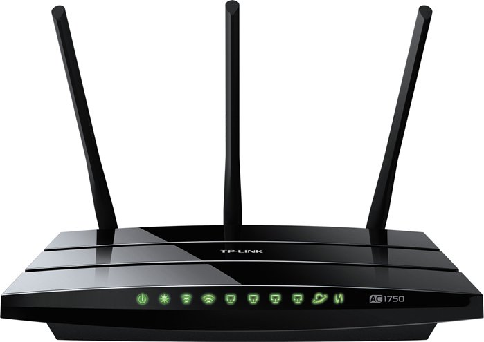
	
	Router adalah perangkat jaringan yang berfungsi untuk **menghubungkan dua atau lebih jaringan**. Router menghubungkan jaringan dengan topologi bintang, bus, dan cincin. Berkat dua router jaringan dapat bertukar informasi dan data. Router digunakan dalam protokol jaringan router TCP/IP. Selain itu, router adalah server akses, perangkat yang dapat membuat koneksi yang menghubungkan LAN ke layanan telekomunikasi. Router ini disebut Router DSL (Digital Subscriber Line).

2. Wireless [LAN] Card

	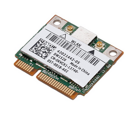
	Perangkat ini dapat **menghubungkan komputer dengan komputer lain menggunakan Wi-Fi tanpa menggunakan kabel**. Saat ini, ada banyak laptop yang memiliki kartu nirkabel di dalamnya, sehingga tidak perlu membeli kartu nirkabel secara terpisah. Tidak seperti laptop, pengguna komputer harus membeli kartu nirkabel secara terpisah untuk terhubung ke Wi-Fi.

3. LAN card

	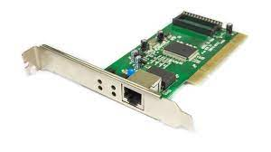
	LAN card dapat **menghubungkan satu komputer ke komputer lain dengan menggunakan menggunakan kabel**. LAN card akan mengubah aliran data dari bentuk paralel ke bentuk serial, dan data akan dikirim melalui kabel UTP.

4. Bridge

	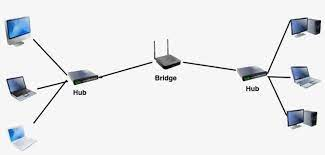
	
	Perangkat ini dapat **memperluas jaringan** sehingga dapat digunakan oleh perangkat lain dalam jangkauan luas. Bridge berfungsi untuk meneruskan data, membagi jaringan menjadi beberapa jaringan. Ini membuat jangkauan jaringan menjadi luas. Bridge memiliki tabel Bridge internal yang berfungsi untuk menentukan segmen mana yang harus disaring.
	
5. Hub

	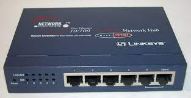
	Fungsi hub adalah untuk **membagi server ke jaringan lain**. hub akan menyalin data dari sumber yang terhubung ke port di hub. Jika di dalam gedung terdapat 10 komputer yang terhubung ke hub dan memiliki satu komputer sumber data, hub akan membagikan data tersebut dengan perangkat yang terhubung. Namun, jika hub mengalami gangguan transmisi ke jaringan lain, itu akan terhambat.

6. Switch

	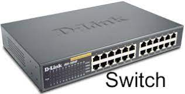

	Cara kerja perangkat ini hampir mirip dengan hub, tetapi switch lebih pintar dalam membagi sinyal koneksi. Menggunakan switch, area jaringan dapat menjadi lebih baik dan lebih cepat untuk mengirim data. Perangkat ini juga dapat **mengatasi tabrakan data**.
	
7. Access Point

	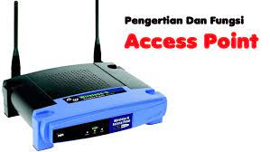
	Fungsi perangkat ini adalah untuk **memancarkan sinyal dari router**. Sinyal digunakan untuk membuat jaringan WLAN. Access Point juga dapat membuat kita terhubung ke jaringan LAN tanpa meng-gunakan kabel. Kemudian dari titik akses tersebut dapat dikatakan dapat meng-hubungkan dua jaringan yang berbeda, yaitu jaringan nirkabel dan jaringan LAN.

8. Repeater

	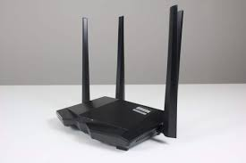

	Repeater adalah perangkat jaringan yang dapat memperkuat sinyal dan mem-perluas jangkauan sinyal Wi-Fi. Repeater membuat perangkat dapat mengakses wifi dengan mudah. Re-peater tidak perlu menggunakan kabel untuk memini-malkan penggunaan kabel.

9. NIC (*Network Interface Card/Controller*)

	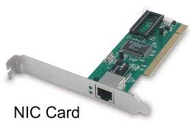

	Network Interface Card (NIC) adalah kartu yang dapat menghubungkan komputer dengan jaringan LAN. Perangkat dapat terhubung ke jaringan menggunakan kabel.

10. Konektor

	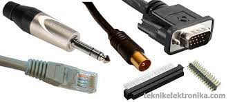

	Konektor berfungsi untuk **menghubungkan kabel dengan adaptor jaringan**. Konektor adalah alat vital untuk perangkat komputer. Jika konektor tidak terpasang, komputer tidak dapat berjalan secara optimal.

# Enkripsi

## Proteksi Data
Data protection, proteksi data, atau perlindungan data adalah berbagai **langkah keamanan yang digunakan untuk melindungi data berharga**. Terdapat beberapa prosedur pengamanan, salah satu teknik yang sering digunakan untuk keamanan data adalah penyandian (enkripsi). Enkripsi berasal dari kata *encryption* yang berasal dari Bahasa Yunani yaitu *kryptos* yang berarti tersembunyi. Penyandian (enkripsi) data merupakan proses pengubahan informasi data agar data tidak terbaca.

Sebelum dienkripsi, **data-data yang masih mentah** disebut **plaintext**. Data tersebut dienkripsi menggunakan **algoritma enkripsi** serta **kunci enkripsi**. Algoritma enkripsi ini terdiri atas dua jenis yaitu **simetris** dan **asimetris**. Keduanya mempunyai fungsi yang sama yaitu memungkinkan penggunaan untuk mengenkripsi data dan kemudian mendekripsi data untuk mengakses plain text asli. Namun, kedua jenis ini berbeda dalam cara menangani langkah antara enkripsi dan dekripsi. 

## Enkripsi Kunci Simetris
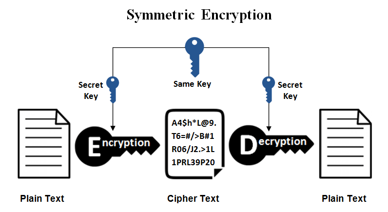

Enkripsi dengan kunci simetris menggunakan **kunci privat yang sama untuk melakukan enkripsi dan dekripsi** terhadap data. Saat akan melakukan dekripsi, pengirim akan terlebih dahulu membagikan kunci privatnya ke orang yang akan mendekripsikan data.

Contoh kasus:

Sani dan Siri keduanya memiliki kunci untuk membuka sebuah kotak. Dalam scenario ini kunci yang mereka miliki melakukan hal yang sama. Keduanya dapat menambah atau membuang sesuatu dari kotak. Jadi, Sani dapat mengenkripsi pesan serta mendekripsi dengan kuncinya. Siri juga dapat melakukan hal yang sama dengan miliknya.

## Enkripsi Kunci Asimetris
Algoritma ini menggunakan **kunci enkripsi berbeda untuk enkripsi dan dekripsi data**. Kunci publik dapat digunakan untuk mengenkripsi data, dan data tersebut hanya dapat didekripsi dengan kunci privat. Biasanya ini disebut sebagai *Public Key Cryptography*. Enkripsi asimetris banyak digunakan dalam **saluran komunikasi sehari-hari, terutama melalui Internet**. Algoritma enkripsi asimetris yang populer digunakan antara lain EIGamal, RSA, DSA, Elliptic, dan PKCS.

Contoh kasus:

Sani dan Siri memiliki kunci untuk membuka sebuah kotak. Sani memiliki kunci publik dan Siri memiliki kunci privat yang cocok. Sani bisa menggunakan kuncinya untuk membuka kotak dan meletakkan segala sesuatu ke dalamnya. Tetapi, Sani tidak bisa melihat barang-barang yang sudah ada didalam kotak tersebut dan tidak bisa mengambil apa-apa. Disamping itu, Siri bisa membuka kotak dan melihat semua barang di dalamnya ataupun membuangnya. Namun, Siri tidak bisa menambahkan sesuatu ke kotak tanpa memiliki kunci public tambahan. Jadi, Sani dapat mengenkripsi plain text dengan kunci publik dan mengirimkannya pada Siri. Namun, hanya Siri yang dapat mendekripsi *chiphertext* dari Sani kembali ke *plaintext*.
