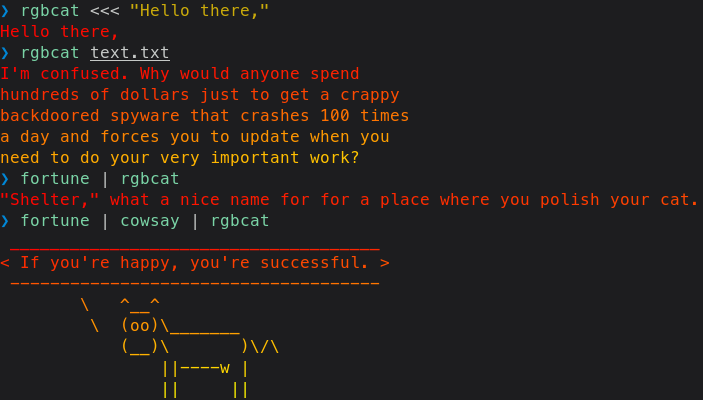



# RGBcat

RGBcat is a little software that prints a text file with rainbow color. It's similar to [lolcat](https://github.com/busyloop/lolcat/) but less sophisticated and faster™.

<!--[Grab the source code](rgbcat.c).-->

Alright I can't find my source code, I think it's on one of my thumb drive but I can't remember where I put it, so [here's a pre-compiled x86\_64 glibc Linux binary, I guess](rgbcat) (md5: `a1ffe12f4dffa538bccc91de519a02ac`). I'm going to put the source code here when I found my thumb drive :P

Also yeah I can't do math and stuff so the source code is stupid—but hey it works I guess.
