

Say hello to my friends...

# Physical Things

## IdeaPad Gaming 3

A Lenovo Gaming 3 Laptop I got back in April 2022.

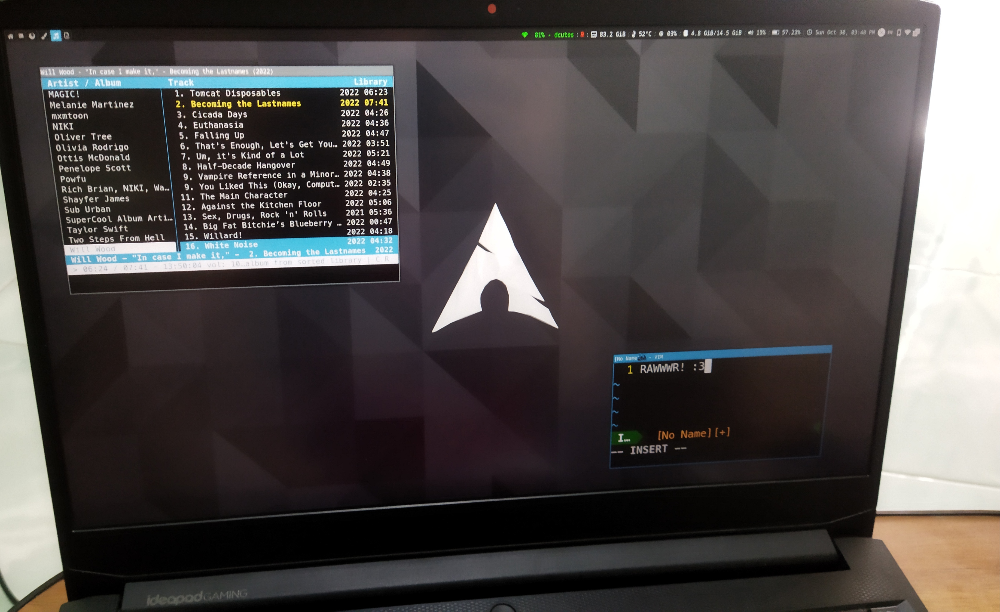

And of course it needs a sticker from [Unixstickers](https://www.stickermule.com/unixstickers).

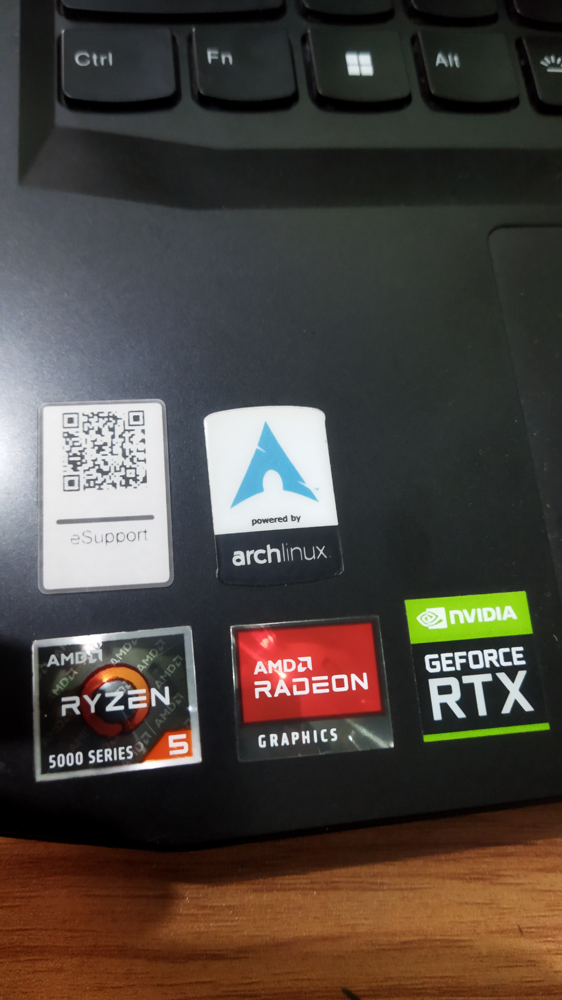

```
CPU: AMD Ryzen 5 5600H with Radeon Graphics (12) @ 3.300GHz
GPU: AMD ATI 05:00.0 Cezanne
GPU: NVIDIA GeForce RTX 3050 Mobile
Memory: 4820MiB / 14842MiB
```

## Lenovo IdeaPad G400s

My laptop that I had since 2013. Dead battery and touchpad but the rest are fine. Has drank a cup of tea and survived, haha.

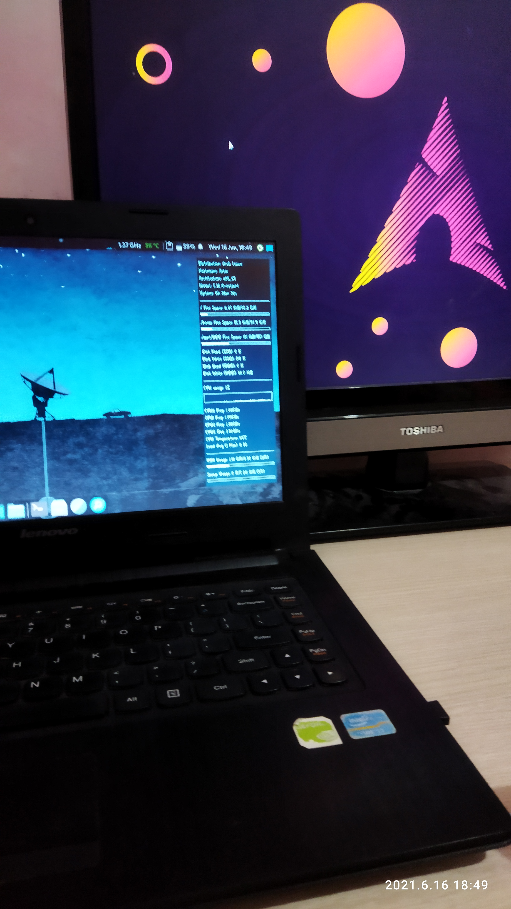


## Asus ZenFone Max Pro M1

An old phone I got after one of my family got a new phone. Compatible with Android alternatives so I slapped Ubuntu Touch on it.

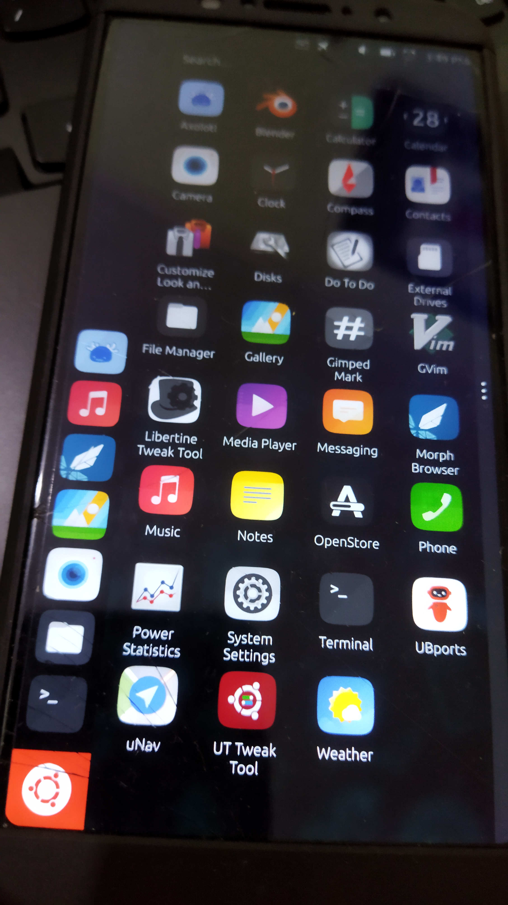


## Normie Redmi 9T Phone

A phone for when I'm in my normie mode.
*Has Google Chrome uninstalled

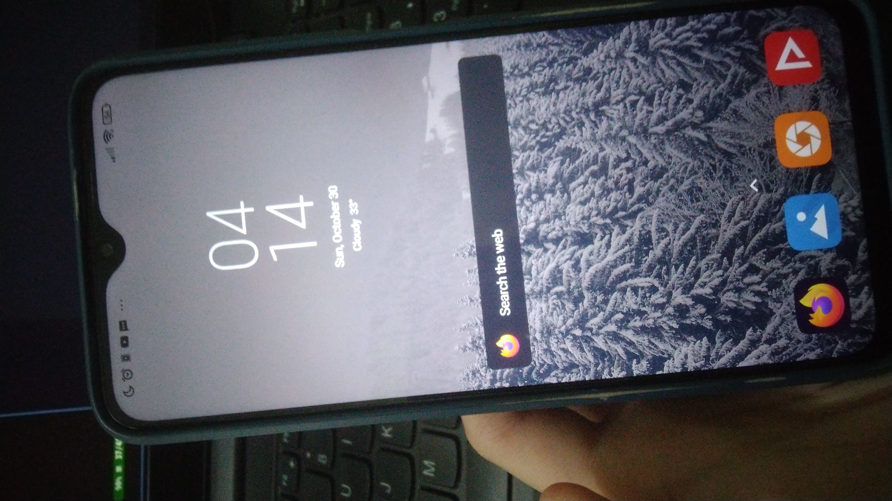

## WD Disk

A My Passport™ hard disk to replace my old Seagate (internal) drive.

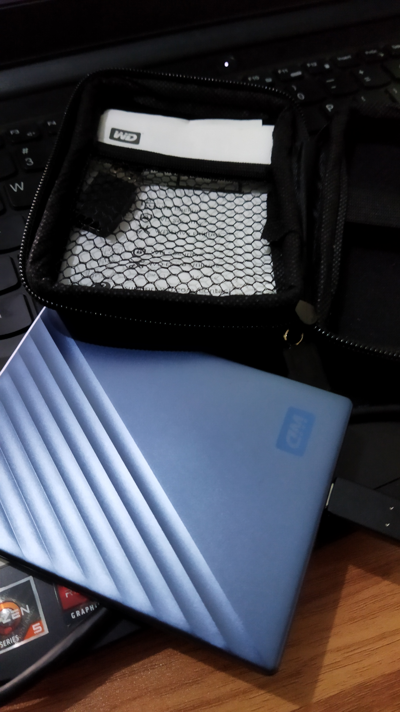

## Timmy

My favorite plush! Got it as a gift when I was a kid.

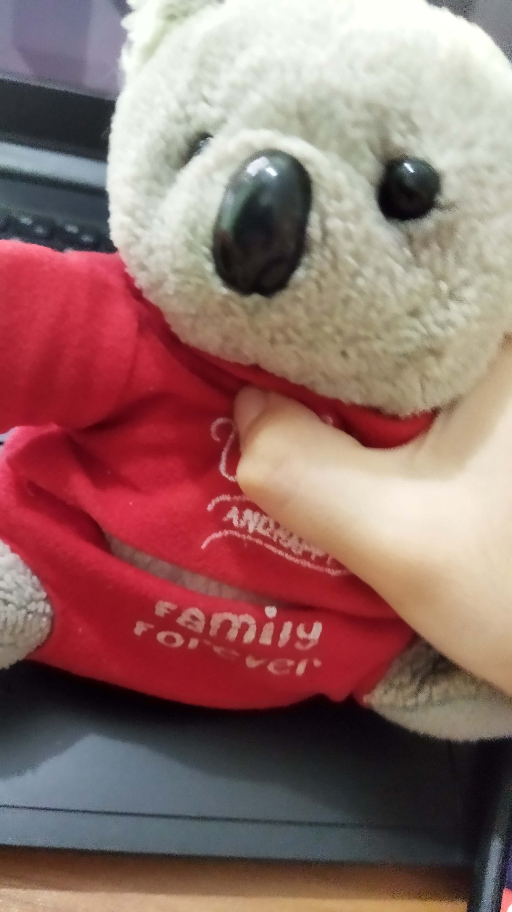


# OS's

Systems that I own.

## Felice
Bootstrapped on April 23rd 2022. Arch Linux. My daily driver; installed on my IdeaPad Gaming 3. Uses i3, has Awesome installed too. She has a cat pet called Fred (see [Oneko](http://www.daidouji.com/oneko/)) :D

Rice is... exclusive for me ;)

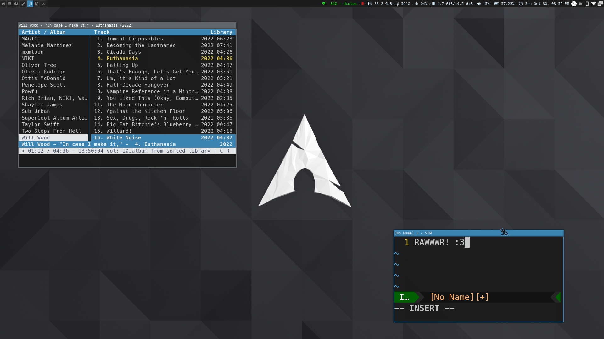

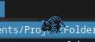

## Fern
Bootstrapped on September 7th, 2021. My second Artix Linux. Installed on my WD disk. Its purpose is as a sandbox. Has TONS of WMs and DEs installed.

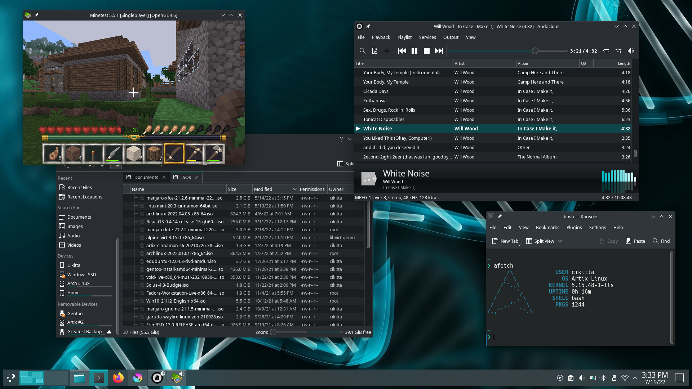

## Matt
Unpacked on December 12th, 2021. Just a normal Gentoo system I kept around after being played for a month. Have no idea when I last upgraded it so if I run `emerge sync && emerge -auDN @world` now it'll last a day or so.

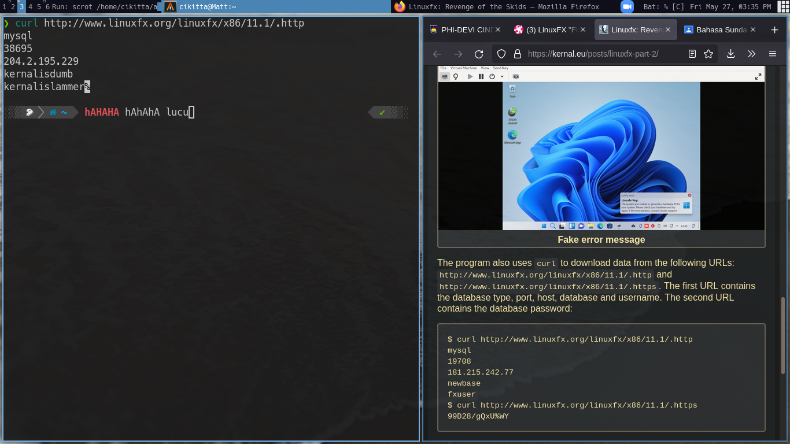

## Lyra
An Ubuntu Touch. Installed on June 16th, 2022. Successfully installed after months of trying. Installed on my Asus ZenFone. 

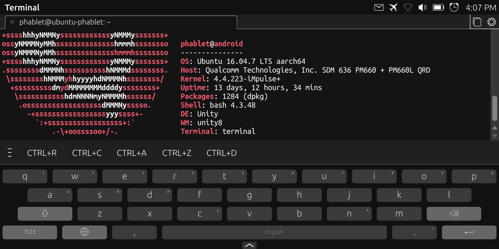

## Artix
Bootstrapped on June 14th, 2021. I thought she's going to be the last system to be daily driven but I'm wrong. Yeah she didn't have a name sadly :( Right now installed on my IdeaPad G400s.

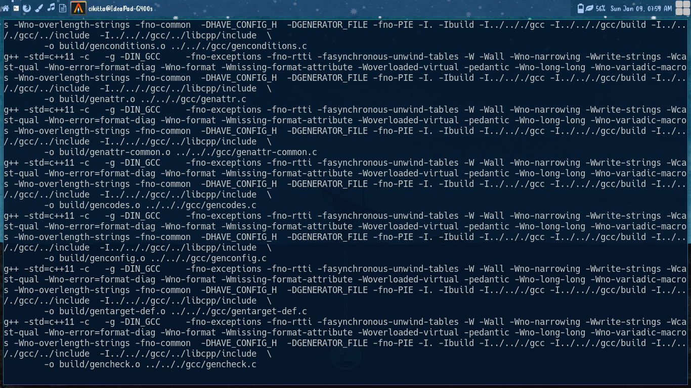


## W11

A normal W11. I rarely touch it. No screenshot since it's just a default W11 desktop. You can search how it looks on the internet.
